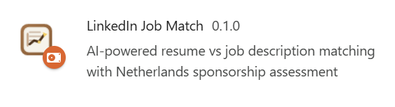
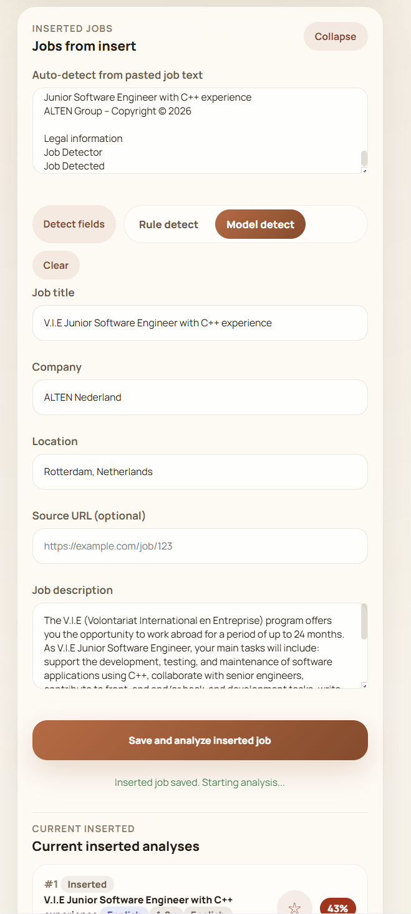
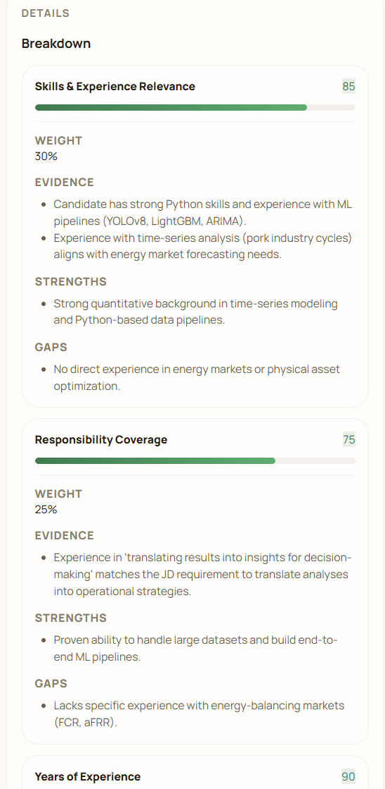
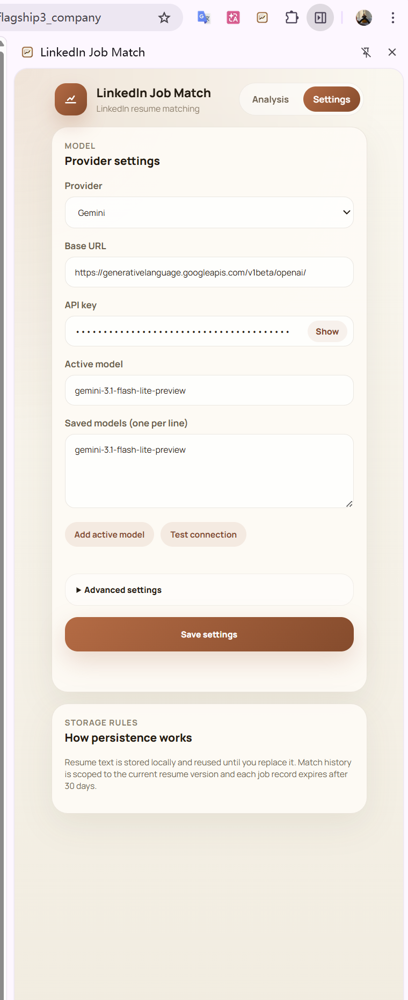

[中文](./README.zh-CN.md) | **English**

# LinkedIn Job Match

`LinkedIn Job Match` is a Chrome Manifest V3 extension for faster job screening on LinkedIn and beyond. It compares a resume against job descriptions, injects match badges into LinkedIn, keeps reusable analysis history, and adds Netherlands sponsorship signals using a local IND-derived dataset.

Current release metadata:

- Extension name: `LinkedIn Job Match`
- Current manifest version: `0.1.2`
- Tech stack: `Chrome Extension MV3 + Vite + Vanilla JavaScript`

## Extension Snapshot



## What It Does

The extension is designed to reduce repetitive JD screening work. It can:

- read job descriptions from LinkedIn detail pages and search result pages
- persist the uploaded resume locally until the user replaces or removes it
- score fit with multiple LLM providers
- cache analysis results by resume, scoring profile, prompt version, and model configuration
- inject match badges and metadata badges directly into LinkedIn
- detect JD language, required experience, and required job languages
- evaluate Netherlands sponsorship signals using a local IND-derived sponsor dataset
- save interesting positions for later review
- keep separate analysis history for LinkedIn jobs and manually inserted jobs
- let users paste jobs from non-LinkedIn sources and analyze them inside the same side panel

## What's New In v0.1.2

- New `Library` section for:
  - `History`
  - `Saved`
  - `LinkedIn`
  - `Inserted`
- Saved positions can now be starred and revisited later
- History and saved items open in an in-card secondary detail view with a back button
- Inserted jobs now have their own section above list mode
- Users can paste jobs from other sources and choose:
  - `Rule detect`
  - `Model detect`
- Inserted jobs can be analyzed, re-analyzed, edited, saved, deleted, and reopened from history
- Single history entries and saved entries can be removed individually
- Detail views no longer auto-scroll the side panel to the bottom when opened

## Core Features

### 1. Persistent resume storage

The uploaded resume is stored in `chrome.storage.local` and stays available after:

- page refresh
- side panel reopen
- browser restart

It is replaced only when the user uploads a new one or explicitly removes the current file.

### 2. Single-job analysis

On a LinkedIn job detail page, the extension reads:

- job title
- company
- location
- job description text

It then shows the result in the side panel and reuses cache when the same job has already been analyzed for the same resume and scoring context.

### 3. List mode analysis

On LinkedIn search result pages, the extension can:

- detect visible job cards on the page
- analyze the first `N` jobs automatically
- load and show more jobs from the same page
- reuse cached results instead of re-calling the model
- re-analyze the current job or the shown jobs
- open a second-level detail view inside the side panel when a list item is clicked

### 4. Library and saved positions

The new `Library` section lets users:

- switch between `History` and `Saved`
- switch between `LinkedIn` and `Inserted`
- reopen prior analyses in an in-card detail view
- remove single history entries
- remove single saved positions

### 5. Inserted jobs

The `Jobs from insert` section supports pasted jobs from other sources.

Users can:

- paste raw job text
- choose `Rule detect` for fast local extraction
- choose `Model detect` for AI-assisted structuring
- review detected fields
- save and analyze the inserted job
- reopen inserted job results later

### 6. Inline LinkedIn badges

The extension injects badges directly into LinkedIn's native UI.

Supported inline signals include:

- overall match score
- `KM` sponsorship marker
- JD language
- required experience
- required job languages

### 7. Multi-provider model support

The settings UI supports separate profiles for:

- `OpenAI`
- `Anthropic`
- `Gemini`
- `OpenRouter`
- `Poe`
- `Custom`

Each provider keeps its own:

- base URL
- API key
- active model
- saved models
- timeout
- retry settings

## Screenshots

### Main workflow on LinkedIn

This shows score badges injected into LinkedIn, metadata badges, current job context, and list-mode cache reuse.


### Analysis mode and scoring controls

This shows the scoring controls introduced in the recent scoring upgrade.


### Library: history and saved positions

This shows the new `Library` section with reusable analysis history and saved jobs.


### Inserted jobs

This shows the `Jobs from insert` workflow for pasted jobs from non-LinkedIn sources.



### Sponsorship required vs. not required

This demonstrates how sponsorship logic changes when the user explicitly says sponsorship is required or not required.


### Breakdown view

This shows the detailed per-dimension scoring output.



### Settings and provider switching

These screenshots show provider setup, model configuration, connection testing, and provider-specific settings.




### Side panel detail view

This shows the dedicated second-level detail view inside the side panel.


### Chrome loading procedure

This can be used in the installation section to show where users should enable developer mode and load the unpacked extension.


## Repository Structure

```text
assets/                  extension icons and static assets
data/                    IND-derived sponsor data and update script
public/                  build-time copied public files
Screenshot/              README screenshots
src/background/          service worker, cache, config, model integration
src/content/             LinkedIn extraction and badge injection
src/prompts/             prompt templates
src/shared/              shared constants and validation helpers
src/sidepanel/           side panel UI
manifest.json            Chrome extension manifest
package.json             scripts and dependencies
setup_public.js          prepares build assets
vite.config.js           Vite build config
```

## Installation

Important:

- Do not load the project source root folder directly as the extension.
- Always load the built `dist/` folder, or use the GitHub release package and load the extracted extension folder.
- If the wrong folder is loaded, the UI may still open, but resume upload can fail because packaged parser files are missing.

### Option A: Run from source

```bash
npm install
npm run build
```

Then:

1. open `chrome://extensions/`
2. enable `Developer mode`
3. click `Load unpacked`
4. select the `dist/` folder

Reference:


### Option B: Install from a GitHub release asset

1. download the release archive
2. extract it
3. open `chrome://extensions/`
4. enable `Developer mode`
5. click `Load unpacked`
6. select the extracted extension folder

Common mistake to avoid:

- GitHub source archives are not the same as the built extension package.
- If someone downloads the repository source and loads the root folder instead of `dist/`, resume parsing for `PDF` or `DOCX` files may fail.

## Configuration

After opening the side panel:

1. upload a resume in `PDF`, `DOCX`, or `TXT`
2. go to `Settings`
3. choose a provider
4. enter the provider-specific `Base URL`
5. enter the provider-specific `API key`
6. choose an `Active model`
7. optionally add multiple saved models
8. choose an `Analysis mode`
9. choose whether `I need employer sponsorship`
10. optionally enable `Full custom scoring`
11. save settings

## Privacy and Data Handling

- resume content is stored in local extension storage
- API keys are stored in local extension storage
- model requests are only sent to the currently selected provider
- sponsorship checks use the bundled local sponsor dataset

For data attribution guidance, see [DATA_ATTRIBUTION.md](./DATA_ATTRIBUTION.md).

## License

This project is released under the [MIT License](./LICENSE).
