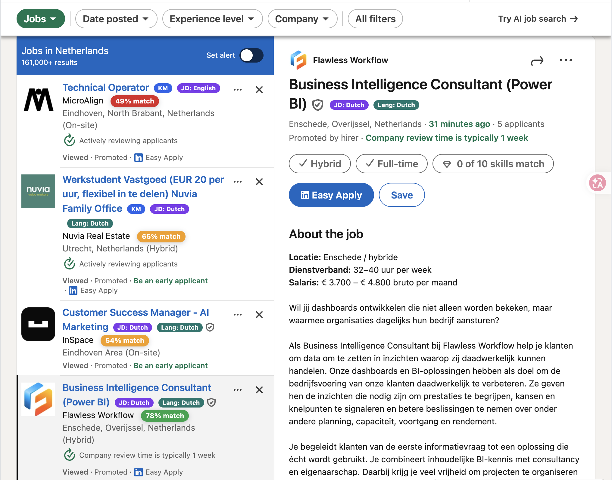
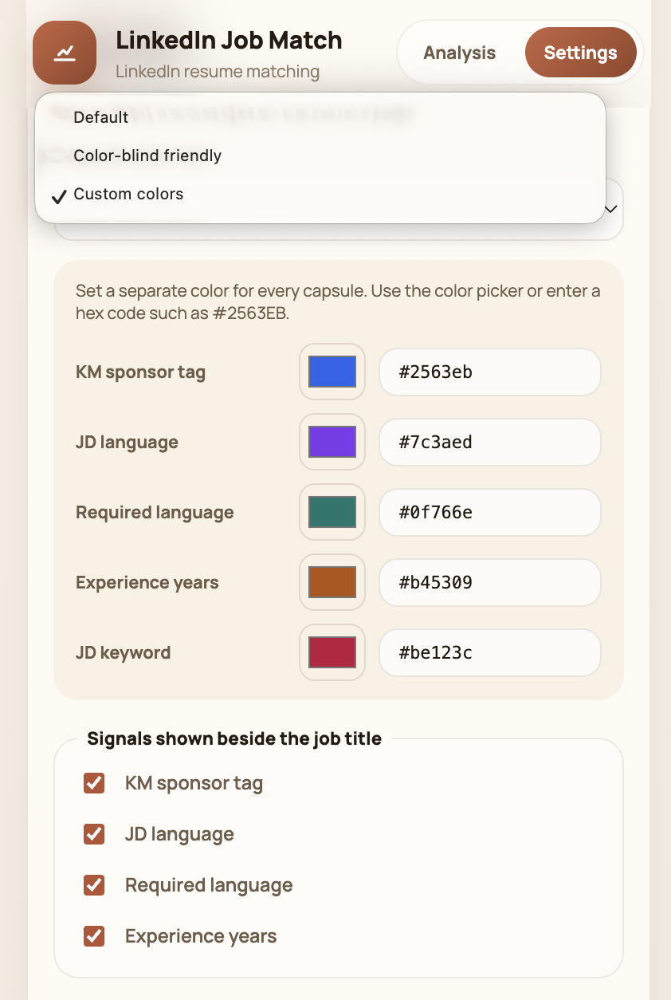
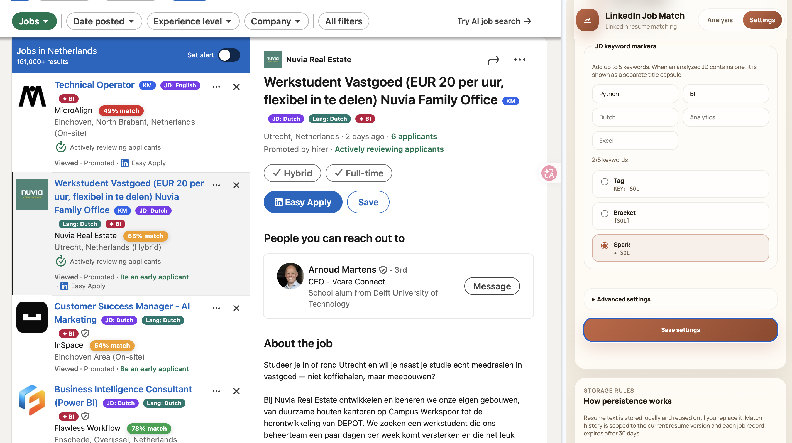

<p align="center">
  
</p>

<p align="center">
  <a href="./README.zh-CN.md">简体中文</a>&nbsp;&nbsp;|&nbsp;&nbsp;<strong>English</strong>
</p>

<p align="center">
  <a href="https://github.com/YuxiaoMa66/linkedin-job-match-extension/tree/main"></a>
  
  
  <a href="./LICENSE"></a>
</p>

<p align="center">
  A local-first Chrome extension for resume matching, reusable job analysis, inline LinkedIn signals, and Netherlands sponsorship context.
</p>

<p align="center">
  <a href="https://github.com/YuxiaoMa66/linkedin-job-match-extension/tree/main"><strong>Use v0.4.0 on main</strong></a>
  &nbsp;&nbsp;|&nbsp;&nbsp;
  <a href="#installation">Installation</a>
  &nbsp;&nbsp;|&nbsp;&nbsp;
  <a href="#configuration">Configuration</a>
</p>

> [!NOTE]
> `v0.4.0` is now merged into `main`. The feature branch remains available as the AI-search implementation history; the current main version supersedes the earlier releases.

> [!IMPORTANT]
> **Current LinkedIn compatibility**
>
> v0.4.0 supports both LinkedIn's **classic Jobs search** and the newer **AI-powered / semantic search** interface. On the AI layout, it reads the visible job cards and the selected job detail. After updating the extension or switching between search layouts, refresh the LinkedIn page so the content reader attaches to the current layout.

<p align="center">
  
</p>

## Quick start

1. **First install:** download a built ZIP, extract it, and load the extracted folder from `chrome://extensions/` → `Developer mode` → `Load unpacked`.
2. **Update an existing v0.1.2+ installation:** extract the new ZIP, replace the files inside the original extension `Location`, keep the folder path unchanged, and click `Reload` on the original card.
3. **Use either LinkedIn search layout:** v0.4.0 reads Classic Jobs search and AI-powered search. After switching layouts or updating the extension, refresh the page.
4. Upload your resume in the side panel, open a job or a visible job list, and run the analysis.

The same-folder update keeps the extension ID and therefore preserves local settings, resume data, saved/manual positions, and compatible history. Loading a newly extracted folder creates a separate unpacked extension ID and separate `chrome.storage.local`; the detailed reason and recovery steps are in [Installation](#installation).

## See the decision surface

Match scores and job signals stay inside LinkedIn while the side panel keeps the resume, evidence, history, saved positions, and re-analysis controls together.


The v0.4.0 adapter reads the AI-powered list and selected detail while preserving the same score, cache, history, and title-signal layer used by Classic Search.



Prefer a visual walkthrough? Open the [product homepage](./docs/index.html).

## What It Brings Together

| Capability | What it changes |
| --- | --- |
| Resume-to-role matching | Scores single jobs, visible Classic or AI-powered LinkedIn search results, and jobs pasted from other sources. |
| Inline LinkedIn signals | Adds match scores and configurable title capsules for JD language, required language, experience, sponsorship, and JD keywords. |
| Reusable decision history | Caches compatible analyses, keeps separate LinkedIn and inserted-job history, and saves positions for later review. |
| Provider choice | Supports OpenAI, Anthropic, Gemini, OpenRouter, Poe, and custom OpenAI-compatible endpoints. |
| Netherlands sponsorship context | Checks organisation names against a bundled IND-derived dataset containing 12,927 unique names. |

## What's New In v0.4.0

- Added experimental support for LinkedIn's AI-powered / semantic Jobs search interface, including visible card discovery, stable job IDs, selected-job focus, and `About the job` JD extraction
- Kept the existing Classic Search selectors and workflow as a fallback, so the same extension can read both LinkedIn layouts
- Reused the existing cache and history keys without a storage migration; v0.1.2+ compatible results, sponsor snapshots, settings, resume data, and saved positions remain available when the original extension ID is retained
- Added a verified AI-powered search screenshot showing cached list results, current-job analysis, and inline title capsules

For the concise release record, see the [v0.4.0 release notes](./RELEASE_NOTES_v0.4.0.md).

## What's New In v0.3.1

- Added configurable title capsules for JD language, required language, KM sponsorship, and experience years
- Added color presets, per-signal hex colors, and checkboxes so the title layer can stay useful without becoming noisy
- Added opt-in JD keyword markers for up to five terms, with `Tag`, `Bracket`, and `Spark` styles; cached JD text is reused when settings change
- Added fixed starter models for OpenAI, Anthropic, and Gemini while keeping `Saved models` editable; legacy `gpt-4o` is hidden without removing user-added model IDs
- Preserved v0.1.2+ compatible match and sponsorship history, while keeping the LinkedIn layout and refresh requirements explicit

For the concise release record, see the [v0.3.1 release notes](./RELEASE_NOTES_v0.3.1.md).

## v0.3.1 Reference

### Title capsule color legend

The default set uses one color per signal. The match-score badge is separate and keeps its score-based color.

| Title capsule | Example | Default color | Color-blind-friendly color |
| --- | --- | --- | --- |
| KM sponsorship | `KM` | Blue `#2563EB` | Blue `#0072B2` |
| JD language | `JD: English` | Violet `#7C3AED` | Vermilion `#D55E00` |
| Required language | `Lang: English / Dutch` | Teal `#0F766E` | Green `#009E73` |
| Experience years | `Exp: 3y+` | Amber `#B45309` | Orange `#E69F00` |
| JD keyword | `KEY: SQL` | Rose `#BE123C` | Mauve `#CC79A7` |

In Settings → Title signals, choose the color set from the dropdown. The color-blind-friendly set is designed with stronger hue separation; Custom colors lets you enter a hex code for each capsule independently. The four core signals are controlled with checkboxes. Keyword markers are off by default and appear only after you enable them and an analyzed JD matches one of the five configured keywords.

### Product views

These two views show the product result without turning the changelog into a screenshot gallery:



The optional keyword layer is opt-in. When it is enabled and the captured JD contains a configured term, the matching term becomes its own title capsule.



### Fixed provider starter models

The provider switch does not fetch models dynamically. This release inserts the following starter value into the editable Saved models field when the provider is selected:

| Provider | Starter model | Official reference |
| --- | --- | --- |
| OpenAI | `gpt-5-mini` | [OpenAI pricing](https://developers.openai.com/api/docs/pricing) |
| Anthropic | `claude-haiku-4-5-20251001` | [Claude models overview](https://docs.anthropic.com/en/docs/about-claude/models/overview) |
| Gemini | `gemini-3.5-flash-lite` | [Gemini 3.5 Flash-Lite](https://ai.google.dev/gemini-api/docs/models/gemini-3.5-flash-lite) |

The Saved models textarea remains editable. Keep the starter model, replace it, or add additional model IDs with `Add active model`.

## What's New In v0.2.0

- Refreshed the bundled IND-derived sponsor dataset from the 2026-08-26 source snapshot
- Bundled 12,927 unique organisation names after collapsing duplicate rows
- Added sponsor dataset revision checks so older local sponsor caches are ignored after an update
- Added a standalone product homepage in `docs/` with the workflow, screenshots, signals, and local install path
- Added GitHub-rendered README links so the Chinese documentation displays correctly

## What's New In v0.1.2

- New `Library` section for:
  - `History`
  - `Saved`
  - `LinkedIn`
  - `Inserted`
- Saved positions can now be starred and revisited later
- History and saved items open in an in-card secondary detail view with a back button
- Inserted jobs now have their own section above list mode
- Users can paste jobs from other sources and choose:
  - `Rule detect`
  - `Model detect`
- Inserted jobs can be analyzed, re-analyzed, edited, saved, deleted, and reopened from history
- Single history entries and saved entries can be removed individually
- Detail views no longer auto-scroll the side panel to the bottom when opened

## Core Features

### 1. Persistent resume storage

The uploaded resume is stored in `chrome.storage.local` and stays available after:

- page refresh
- side panel reopen
- browser restart

It is replaced only when the user uploads a new one or explicitly removes the current file.

### 2. Single-job analysis

On a LinkedIn job detail page, the extension reads:

- job title
- company
- location
- job description text

It then shows the result in the side panel and reuses cache when the same job has already been analyzed for the same resume and scoring context.

### 3. List mode analysis on Classic and AI-powered Jobs search

On LinkedIn's Classic or AI-powered Jobs search results page, the extension can:

- detect visible job cards on the page
- read AI-powered cards from their stable LinkedIn component keys and retain the job ID used by the existing cache
- focus an AI-powered card and wait for the selected detail pane before reading the JD
- analyze the first `N` jobs automatically
- load and show more jobs from the same page
- reuse cached results instead of re-calling the model
- re-analyze the current job or the shown jobs
- open a second-level detail view inside the side panel when a list item is clicked

### 4. Library and saved positions

The new `Library` section lets users:

- switch between `History` and `Saved`
- switch between `LinkedIn` and `Inserted`
- reopen prior analyses in an in-card detail view
- remove single history entries
- remove single saved positions

### 5. Inserted jobs

The `Jobs from insert` section supports pasted jobs from other sources.

Users can:

- paste raw job text
- choose `Rule detect` for fast local extraction
- choose `Model detect` for AI-assisted structuring
- review detected fields
- save and analyze the inserted job
- reopen inserted job results later

### 6. Inline LinkedIn badges

The extension injects badges directly into LinkedIn's native UI.

Supported inline signals include:

- overall match score
- `KM` sponsorship marker
- JD language
- required experience
- required job languages

### 7. Configurable title capsules and JD keyword markers

Open Settings → Title signals to:

- choose the default or color-blind-friendly palette
- enter a separate custom hex color for every capsule
- toggle KM, JD language, required language, and experience years independently
- add up to five JD keywords and choose the marker style shown in the title

The keyword scan is based on the JD text already captured for an analyzed job. Saving new settings refreshes the visible LinkedIn page.

### 8. Multi-provider model support

The settings UI supports separate profiles for:

- `OpenAI`
- `Anthropic`
- `Gemini`
- `OpenRouter`
- `Poe`
- `Custom`

Each provider keeps its own:

- base URL
- API key
- active model
- saved models
- timeout
- retry settings

## Screenshots

### Analysis mode and scoring controls

This shows the scoring controls introduced in the recent scoring upgrade.


### Library: history and saved positions

This shows the new `Library` section with reusable analysis history and saved jobs.


### Inserted jobs

This shows the `Jobs from insert` workflow for pasted jobs from non-LinkedIn sources.


### Sponsorship required vs. not required

This demonstrates how sponsorship logic changes when the user explicitly says sponsorship is required or not required.


### Breakdown view

This shows the detailed per-dimension scoring output.


### Settings and provider switching

These screenshots show provider setup, model configuration, connection testing, and provider-specific settings.


### Side panel detail view

This shows the dedicated second-level detail view inside the side panel.


## Repository Structure

```text
assets/                  extension icons and static assets
data/                    IND-derived sponsor data and update script
public/                  build-time copied public files
Screenshot/              README screenshots
src/background/          service worker, cache, config, model integration
src/content/             LinkedIn extraction and badge injection
src/prompts/             prompt templates
src/shared/              shared constants and validation helpers
src/sidepanel/           side panel UI
manifest.json            Chrome extension manifest
package.json             scripts and dependencies
setup_public.js          prepares build assets
vite.config.js           Vite build config
```

## Installation

Important:

- Do not load the project source root folder directly as the extension.
- Always load the built `dist/` folder, or use the GitHub release package and load the extracted extension folder.
- If the wrong folder is loaded, the UI may still open, but resume upload can fail because packaged parser files are missing.

### Option A: Run from source

```bash
npm install
npm run build
```

Then:

1. open `chrome://extensions/`
2. enable `Developer mode`
3. click `Load unpacked`
4. select the `dist/` folder

Reference:


### Option B: Install from a GitHub release asset

1. download the release archive
2. extract it
3. open `chrome://extensions/`
4. enable `Developer mode`
5. click `Load unpacked`
6. select the extracted extension folder

Common mistake to avoid:

- GitHub source archives are not the same as the built extension package.
- If someone downloads the repository source and loads the root folder instead of `dist/`, resume parsing for `PDF` or `DOCX` files may fail.

To build the current version from source, use the `main` branch with Option A. The matching built package is attached to the [v0.4.0 GitHub Release](https://github.com/YuxiaoMa66/linkedin-job-match-extension/releases/tag/v0.4.0).

### Update the existing extension without creating a second one

To keep the resume, settings, saved positions, manual jobs, and v0.1.2+ match history, update the extension in the same folder that Chrome already knows:

1. Open `chrome://extensions/`, open the existing extension's `Details`, and copy its `Location` path.
2. Back up that original folder before changing anything.
3. Extract `linkedin-job-match-v0.4.0.zip` into a temporary folder.
4. Copy the contents inside the extracted package into the existing `Location`, replacing the old files. Keep the original parent folder and path unchanged; do not create a nested `dist/` folder.
5. Return to `chrome://extensions/` and click `Reload` on the existing extension card.
6. Refresh the LinkedIn tab and reopen the side panel so the new content script is attached.

Do not click `Load unpacked` on the newly extracted folder, and do not drag it in as a separate unpacked extension. Chrome will assign that folder a separate extension ID and separate `chrome.storage.local`, which makes it look like a new plugin. If a duplicate was already loaded, remove only the duplicate card and update the original folder in place.

This release does not clear `ljm_config`, `persistentResume`, `ljm_saved_positions_v1`, `ljm_manual_jobs_v1`, or the v3 match cache. v0.1.2 and later analyzed results remain displayable for the same resume, including older sponsor and match snapshots; jobs that were never analyzed remain unanalysed. Existing cache expiry rules still apply. Chrome cannot automatically expose storage from a different extension ID, so a new folder cannot safely migrate old data by itself.

Why not drag the ZIP directly? A ZIP is only a package. Loading its extracted folder as a new unpacked extension creates a different extension ID and a separate `chrome.storage.local`; Chrome then shows an apparently empty plugin. Updating the files inside the original `Location` keeps the original extension entry and its local data.

## Configuration

After opening the side panel:

1. upload a resume in `PDF`, `DOCX`, or `TXT`
2. go to `Settings`
3. choose a provider
4. enter the provider-specific `Base URL`
5. enter the provider-specific `API key`
6. choose an `Active model`; selecting OpenAI, Anthropic, or Gemini seeds the editable `Saved models` field with this release's fixed low-cost starter
7. edit `Saved models` or add multiple models with `Add active model` when needed
8. choose an `Analysis mode`
9. choose whether `I need employer sponsorship`
10. optionally enable `Full custom scoring`
11. open `Title signals` and choose the visible capsules
12. optionally select a color scheme, enter independent custom hex colors, enable keyword markers, and add up to five JD keywords
13. save settings

## Privacy and Data Handling

- resume content is stored in local extension storage
- API keys are stored in local extension storage
- analyzed job caches may store a bounded local JD excerpt so keyword markers can be recalculated after settings changes
- model requests are only sent to the currently selected provider
- sponsorship checks use the bundled local sponsor dataset

For data attribution guidance, see [DATA_ATTRIBUTION.md](./DATA_ATTRIBUTION.md).

## License

This project is released under the [MIT License](./LICENSE).
