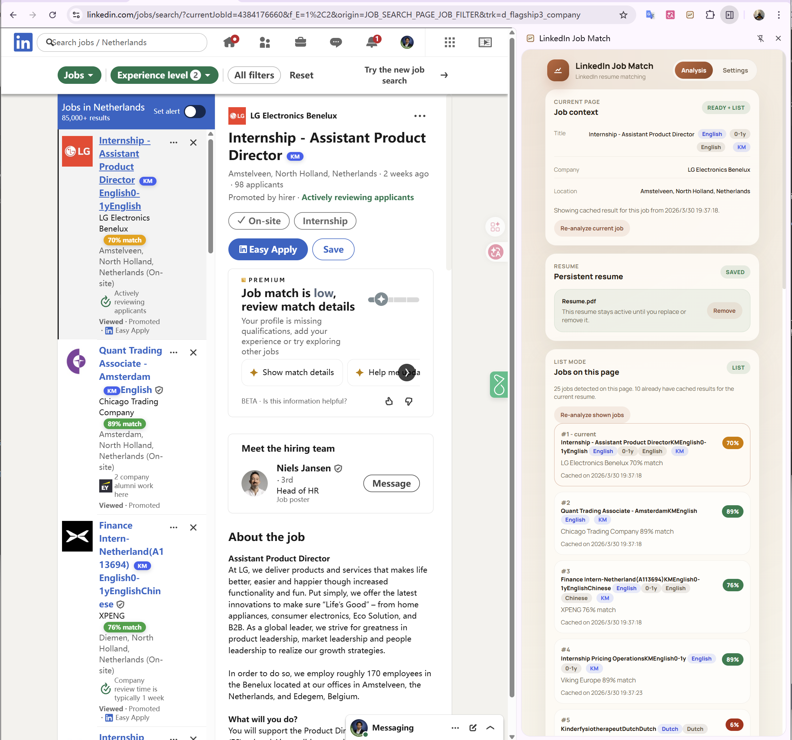

**中文** | [English](./README.md)

# LinkedIn Job Match

`LinkedIn Job Match` 是一个基于 Chrome Manifest V3 的浏览器扩展，用来比较简历与 LinkedIn 岗位描述之间的匹配度，并把结构化结果和荷兰 sponsorship 信号直接显示在 LinkedIn 页面里。

当前版本信息：

- 扩展名称：`LinkedIn Job Match`
- 当前 manifest 版本：`0.1.1`
- 技术栈：`Chrome Extension MV3 + Vite + Vanilla JavaScript`

## 扩展展示


## 项目能做什么

这个扩展是为更高效地筛选 LinkedIn 岗位而做的。它可以：

- 在 LinkedIn 单岗位页和搜索列表页读取岗位信息
- 将上传的简历持久保存在本地，直到用户主动替换或删除
- 通过多个 LLM provider 计算岗位匹配分数
- 按简历、评分配置、Prompt 版本和模型配置缓存结果
- 在 LinkedIn 原生页面里直接注入匹配分数和元信息角标
- 检测 JD 语言、岗位要求经验年限、岗位要求语言
- 基于本地 IND sponsor 数据做荷兰 sponsorship 判断

## v0.1.1 更新重点

- 新增统一的 `Analysis mode`，包含 `Strict`、`Balanced`、`Potential`、`Sponsorship-first`
- 新增 `I need employer sponsorship` 开关，由用户明确决定 sponsorship 是否应该影响评分
- sponsorship 评分改成规则优先，不再完全依赖模型自由发挥
- sponsorship 状态更清楚：`Supported`、`Hard blocker`、`Conflicting signals`、`Not needed`
- 新增 `Enable full custom scoring`
  - 支持完全自定义权重
  - 支持完整 `Full custom prompt`
  - 支持附加 prompt instructions
- 更清楚地区分 `Raw score` 和最终分数
- 如果是 sponsorship 硬性门槛导致的 `0%`，顶部会直接显示 `Blocked`

## 核心功能

### 1. 简历持久保存

上传后的简历会保存到 `chrome.storage.local`，在以下场景不会丢失：

- 刷新页面
- 关闭再打开侧边栏
- 重启浏览器

只有在以下情况下才会替换当前简历：

- 用户主动删除当前简历
- 用户上传新的简历

### 2. 单岗位分析

在 LinkedIn 单岗位详情页中，扩展会尝试读取：

- 职位标题
- 公司
- 地点
- JD 正文

然后在侧边栏中显示结果。如果同一岗位已经针对当前简历和当前评分配置分析过，则优先复用缓存。

### 3. 列表模式分析

在 LinkedIn 搜索结果页中，扩展可以：

- 识别当前页面可见岗位
- 自动分析前 `N` 个岗位
- 加载当前页更多岗位
- 对已有历史结果的岗位直接复用缓存
- 重新分析当前岗位或当前显示的岗位
- 点击列表项，在侧边栏内部打开二级详情视图

### 4. LinkedIn 原生角标与标签

扩展会直接在 LinkedIn 原生界面中注入这些信息：

- 总体匹配分数
- `KM` sponsorship 标记
- JD 语言
- 岗位要求经验年限
- 岗位要求语言

### 5. 多 provider 模型支持

设置页支持为不同 provider 分别维护独立配置，例如：

- `OpenAI`
- `Anthropic`
- `Gemini`
- `OpenRouter`
- `Poe`
- `Custom`

每个 provider 都会分别保存自己的：

- Base URL
- API key
- Active model
- Saved models
- Timeout
- Retry 设置

## 截图

### LinkedIn 页面整体工作流

这张图展示了最核心的使用场景：

- LinkedIn 页面内的分数角标
- 语言、经验、`KM` 等元信息标签
- 侧边栏中的当前岗位上下文
- list mode 下的缓存结果复用



### Analysis mode

这张图展示了 `v0.1.1` 新增的 `Analysis mode`。


### Analysis preference 设置

这张图展示了主要评分设置区域，包括 sponsorship 需求开关。


### Full custom scoring

这张图展示了 `Enable full custom scoring`、自定义权重和完整自定义 prompt。


### sponsorship 需要与不需要

这两张图展示了当用户明确表示“需要 sponsorship”或“不需要 sponsorship”时，逻辑如何变化。


### Breakdown 详细评分

这张图展示了逐项评分的结构化输出。


### 设置页

这张图展示了 provider、模型和其他通用配置。


### Provider 切换

这张图展示了在多个 provider 之间切换时，保留各自独立配置的能力。


### 连通性测试

这张图展示了在开始分析前验证 provider 和 model 是否可用。


### 批量分析进度

这张图展示了列表模式中批量分析时的进度反馈。


### 侧边栏详情视图

这张图展示了点击列表岗位后，在侧边栏内部打开的二级详情分析页。


### Chrome 加载流程

这张图可以直接用于说明如何在 `chrome://extensions/` 中开启开发者模式并加载已解压扩展。


## 仓库结构

```text
assets/                  扩展图标与静态资源
data/                    IND sponsor 数据与更新脚本
public/                  构建时复制的公开资源
Screenshot/              README 截图
src/background/          service worker、缓存、配置、模型集成
src/content/             LinkedIn 页面提取与角标注入
src/prompts/             prompt 模板
src/shared/              常量与校验辅助
src/sidepanel/           侧边栏 UI
manifest.json            Chrome 扩展清单
package.json             脚本与依赖
setup_public.js          构建前资源准备脚本
vite.config.js           Vite 构建配置
```

## 安装方式

重要提醒：

- 不要直接把项目源码根目录当成扩展加载。
- 一定要加载构建后的 `dist/` 目录，或者使用 GitHub release 包并加载解压后的扩展目录。
- 如果加载了错误目录，界面可能还能打开，但简历上传时会因为解析文件缺失而失败。

### 方式一：从源码运行

```bash
npm install
npm run build
```

然后：

1. 打开 `chrome://extensions/`
2. 开启开发者模式
3. 点击“加载已解压的扩展程序”
4. 选择 `dist/` 目录

参考截图：


### 方式二：从 GitHub Release 安装

如果后续发布了 release zip：

1. 下载 release 压缩包
2. 解压文件
3. 打开 `chrome://extensions/`
4. 开启开发者模式
5. 点击“加载已解压的扩展程序”
6. 选择解压后的扩展目录

一个很常见的错误是：

- 用户下载了 GitHub 仓库源码压缩包，然后直接加载源码根目录。
- 这样虽然扩展界面可能可以打开，但如果没有加载 `dist/`，`PDF` 或 `DOCX` 简历解析就可能失败。

## 配置方式

打开侧边栏后：

1. 上传 `PDF`、`DOCX` 或 `TXT` 简历
2. 进入 `Settings`
3. 选择 provider
4. 填写该 provider 对应的 `Base URL`
5. 填写该 provider 对应的 `API key`
6. 选择 `Active model`
7. 按需要维护多个 `Saved models`
8. 选择 `Analysis mode`
9. 选择是否 `I need employer sponsorship`
10. 按需要开启 `Full custom scoring`
11. 保存设置

## 评分逻辑

### Analysis mode

- `Strict`：对缺少 must-have 要求更保守
- `Balanced`：通用平衡评估
- `Potential`：更看重可迁移能力和成长潜力
- `Sponsorship-first`：更加重视 sponsorship，并允许 sponsorship 成为硬性门槛

### sponsorship 逻辑

如果用户勾选了 `I need employer sponsorship`，那么 sponsorship 会纳入评分。

`v0.1.1` 中 sponsorship 采用规则优先：

- registry 命中且 JD 没明确拒绝 -> 明显正向
- registry 命中但 JD 明确说不提供 sponsorship -> `0`
- registry 未命中但 JD 有正向 sponsorship 表述 -> 低分并显示 `Conflicting signals`
- registry 未命中且 JD 也显示不提供 sponsorship -> `0`

只有 `Sponsorship-first` 模式才会在明确不兼容时把总分直接压成 `0`。

## 缓存规则

当前缓存键会隔离这些因素：

- `jobId`
- `resumeHash`
- `scoringProfileHash`
- `modelKeyHash`
- `promptVersion`

这样可以避免用户在修改简历、provider、评分模式、自定义权重或自定义 prompt 后误用旧结果。

其他缓存行为：

- 已分析岗位优先读取历史结果
- 明显损坏的低质量缓存结果会被过滤
- 超过 30 天的岗位历史记录会自动删除

## 隐私与数据处理

- 简历内容保存在本地扩展存储中
- API key 保存在本地扩展存储中
- 请求只会发送到用户当前选择的模型 provider
- sponsorship 判断使用项目内置的本地数据集

关于数据来源与署名建议，请看 [DATA_ATTRIBUTION.md](./DATA_ATTRIBUTION.md)。

## 发布说明

这个文件夹是为公开 GitHub 仓库整理好的干净上传版本。

它刻意不包含：

- `node_modules`
- 本地日志文件
- 临时调试文件
- 已构建好的 `dist/`

推荐发布流程：

1. 把这个文件夹里的内容上传到 GitHub 仓库
2. 仓库本身作为源码仓库
3. 本地执行 `npm run build`
4. 将 `dist/` 压缩成 zip
5. 将 zip 上传到 GitHub Releases

## License

本项目采用 `MIT` License，见 [LICENSE](./LICENSE)。
