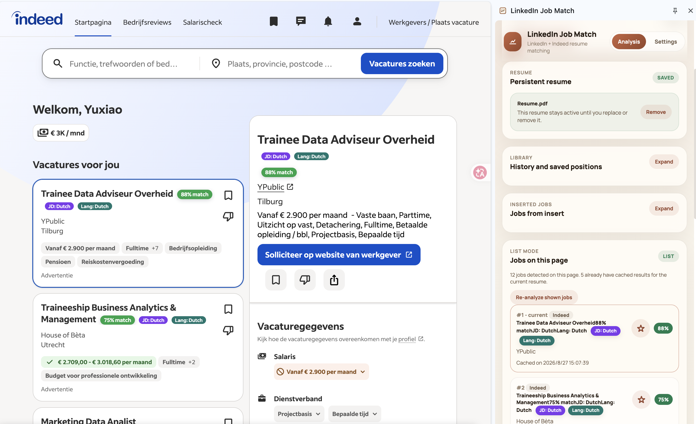

# v0.5.0 — Indeed list adapter

`v0.5.0` adds a tested Indeed list adapter and is published on `main`.

## Added

- Tested support for the Netherlands Indeed site at `https://nl.indeed.com/`
- Visible Indeed job-card discovery using stable `data-jk` / `vjk` identifiers
- Same-page selection of Indeed cards and polling until the selected detail pane renders
- Indeed extraction for title, company, location, and `#jobDescriptionText` job-description content
- `Indeed` as a separate Library source for history and saved positions

## Compatibility

- LinkedIn Classic Search and LinkedIn AI-powered Search remain supported.
- Existing v0.1.2+ LinkedIn, sponsor, resume, settings, manual-job, and saved-position data remains on the same storage keys when the original extension ID is retained.
- Legacy cache entries without `sourceType` continue to display as LinkedIn.
- Jobs that have not been analysed remain unanalysed.
- The cache key format is unchanged for compatibility; Indeed source metadata is stored in the existing summary/result shape.

## Verification

```bash
npm run build
```

The adapter was smoke-tested on the Indeed homepage recommendation list: visible cards were detected, a selected card changed the detail pane, and the side panel displayed the Indeed source, cached match score, JD language, and required-language capsules. For a repeatable check, follow [TESTER_INSTALL_NOTE.md](./TESTER_INSTALL_NOTE.md). Do not load a second extracted folder if the goal is to retain the existing extension data; update the original loaded folder in place.

## Known test boundary

Indeed's DOM can vary by locale, experiment, and page state. This release targets the current `nl.indeed.com` list/detail layout; future Indeed experiments or search-results layouts may need selector updates.


