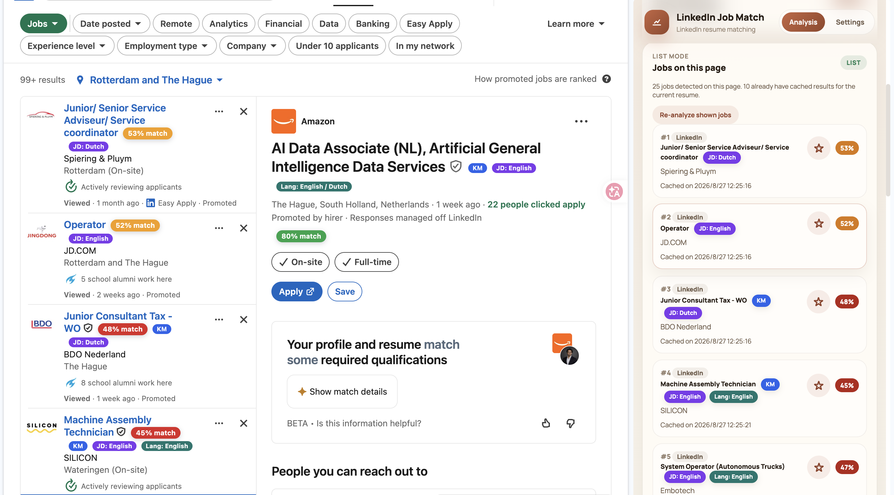

# Tester Install Note — v0.4.0

`v0.4.0` is now merged into `main`. The release adds support for LinkedIn's AI-powered / semantic Jobs search while retaining Classic Search support.

If resume upload fails, the most common reason is that the wrong folder was loaded into Chrome.

Correct installation:

1. Open `chrome://extensions/`
2. Turn on `Developer mode`
3. Click `Load unpacked`
4. Select the built `dist/` folder, or the extracted GitHub release package folder

Please do **not** load the repository source root directly.

If the source root is loaded instead of `dist/`, the extension UI may still open, but resume upload for `PDF` or `DOCX` files can fail because packaged parser files are missing.

## Updating the existing installation without losing data

To preserve data from v0.1.2 onward, do not load the new extracted ZIP as another folder:

1. In `chrome://extensions/`, open the existing extension's `Details` and copy its `Location`.
2. Back up the original extension folder.
3. Extract `linkedin-job-match-v0.4.0.zip` to a temporary folder.
4. Copy the package contents into the existing `Location`, replacing the old files. Keep the original folder path unchanged and do not create a nested `dist/` folder.
5. Click `Reload` on the existing extension card.
6. Refresh the LinkedIn tab and reopen the side panel.

Loading the new folder with `Load unpacked` creates a separate extension ID and separate local storage. The release keeps the existing config, resume, saved/manual positions, and v0.1.2+ cache snapshots when the original folder and ID are retained. It does not turn previously unanalysed jobs into analysed jobs.

The reason is that Chrome scopes `chrome.storage.local` to the extension ID. A ZIP cannot update an unpacked extension by itself; replacing files in the original `Location` keeps the existing extension entry and its data.

## v0.4.0 checks

1. Open an AI-powered LinkedIn Jobs search page. The URL usually contains `origin=SEMANTIC_SEARCH_LANDING_PAGE`.
2. Refresh the page after the extension reload and confirm the side panel shows `Jobs on this page` with detected cards.
3. Confirm cached match scores and title capsules appear beside analyzed jobs.
4. Click several jobs from the side panel and confirm the selected detail and JD change with the job.
5. Re-analyze the shown jobs, then refresh LinkedIn and confirm the list can be read again.
6. Open the side panel's `Settings` tab and confirm the v0.3.1 title-signal, keyword, color, and provider settings still work.
7. Switch LinkedIn back to Classic Search and refresh once to verify the Classic fallback.

